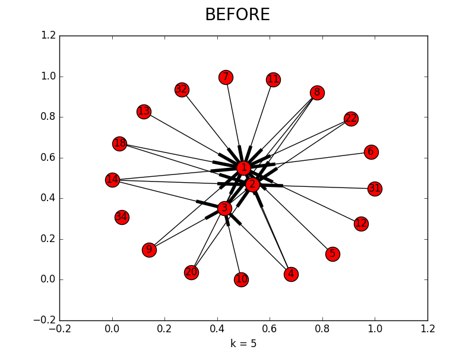
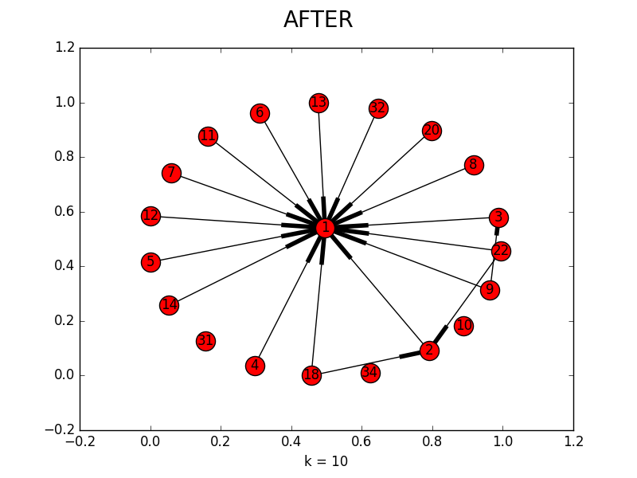
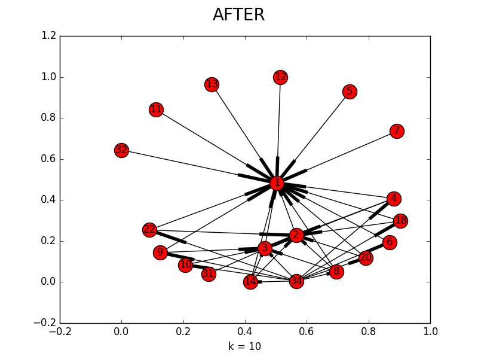

This folder contains the code for addition and deletion of edges. i.e. NetGel and NetMelt algorithm respectively

## Required Arguments
        input file name
        num_edges - number of edges to delete / add

## Optional Arguments
        -g, --gell - add/gell graph
        -d, --directed - directed graph
        -s, --separator - SEPARATOR (in the datasets we have chosen, ":" is the separator)
        -f, --figure draw the graph before and after the k-edge deletion / addition

## Sample Commands for program execution:
For deletion of 5 edges:<br/>
        ```
	python gelling_melting.py karate.txt 5 -d -s : -f
        ```
<br/>For addition of 5 edges:<br/>
        ```
	python gelling_melting.py karate.txt 5 -g -d -s : -f 
        ```

## Example output
```
The edges deleted: 
((14, 3), 1.469655738021863e-33)
((4, 3), 1.4524539771031685e-33)
((3, 2), 1.1022236630809232e-33)
((10, 3), 1.0794217462699453e-33)
((8, 3), 8.915795896967031e-34)

 -------------BEFORE----------------
max flow before: 32
strongly connected score before: 20
weakly connected score before: 20

 -------------AFTER-----------------
max flow after gelling or melting: 25
strongly connected after gelling or melting: 20
weakly connected after gelling or meting: 3
```


## Plots
### Results on the Karate Dataset for 
- Before

<br><br>

- After Removing 10 edges

<br><br>

- After Adding 10 edges 
